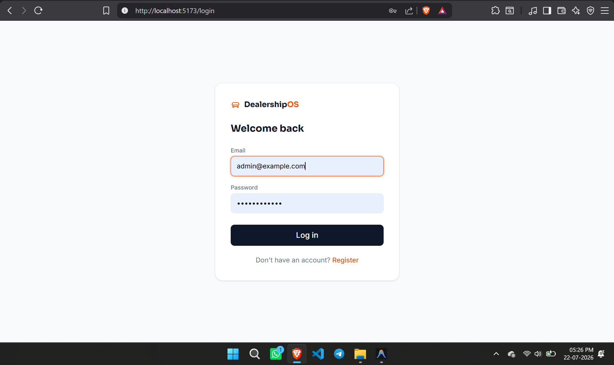
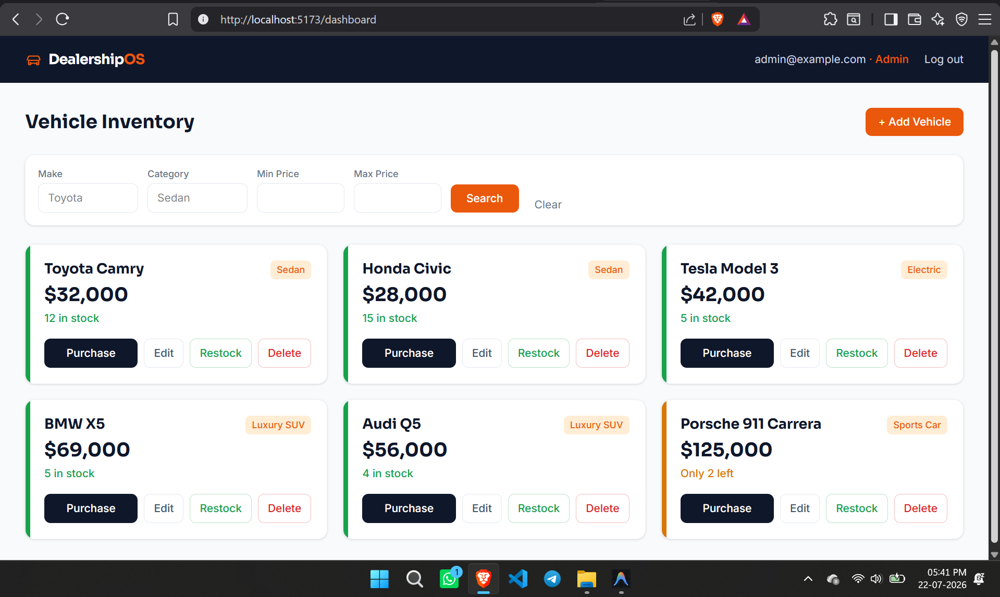
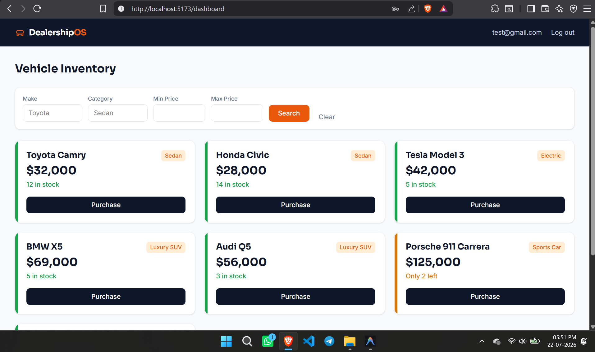
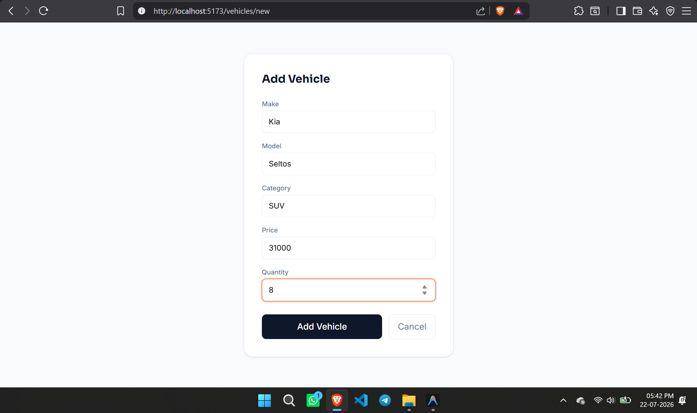
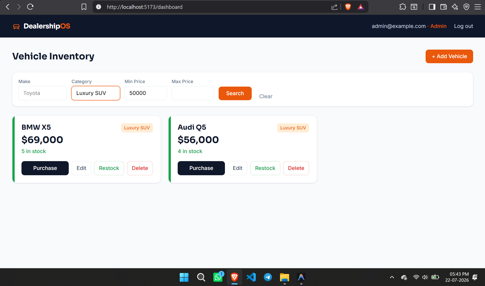
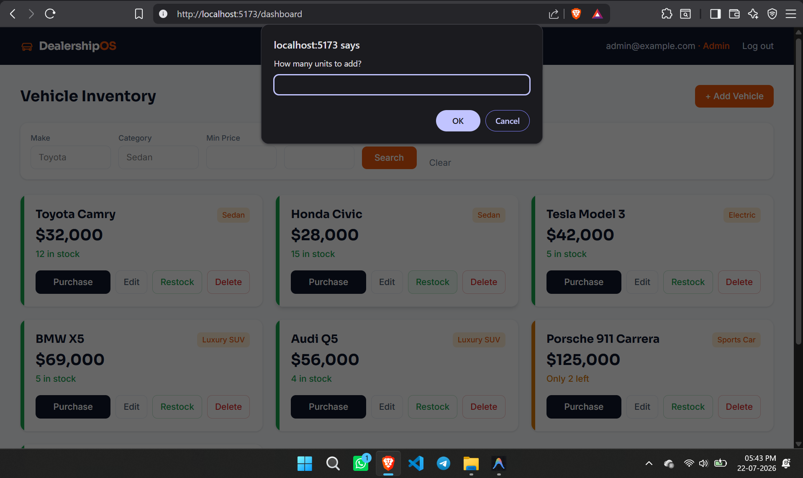

<div align="center">

# 🚗 DealershipOS — Car Dealership Inventory System

[](https://fastapi.tiangolo.com/)
[](https://react.dev/)
[](https://vitejs.dev/)
[](https://tailwindcss.com/)
[](https://www.postgresql.org/)
[](https://supabase.com/)
[](https://vercel.com/)
[](https://docs.pytest.org/)

A full-stack inventory management system for a car dealership, built as a TDD kata for the **Incubyte Software Craftsperson Intern assessment**. Supports user authentication, role-based access control (admin vs. regular users), full vehicle CRUD, search/filtering, and inventory management (purchase/restock).

[🌐 Live Demo](https://car-dealership-inventory-green.vercel.app) • [⚡ API Docs](https://car-dealership-inventory-green.vercel.app/docs) • [🧪 Test Suite](#-test-report)

---

</div>

> [!NOTE]
> All backend business logic was built test-first following a strict **Red-Green-Refactor** cycle, with tests written and committed *before* the corresponding implementation.

---

## 🌟 Live Demo & Test Credentials

🚀 **Live Deployment URL:** [https://car-dealership-inventory-green.vercel.app](https://car-dealership-inventory-green.vercel.app)

| Role | Email | Password | Permissions & Controls |
| :--- | :--- | :--- | :--- |
| 🔑 **Admin** | `admin@gmail.com` | `admin123` | Full access (Add, Edit, Delete, Restock, Purchase) |
| 👤 **User** | `test@gmail.com` | `12345` | Regular user access (Browse, Search, Purchase) |

---

## 📋 Overview

This application lets a dealership manage its vehicle inventory end-to-end:

- 🛍️ **Any registered user** can browse, search, and purchase vehicles.
- ⚙️ **Admin users** can additionally add, edit, delete, and restock vehicles.
- 🧪 **TDD Architecture:** Built test-first with 100% route and business logic test coverage.

---

## 🛠️ Tech Stack

| Layer | Technologies & Tools |
| :--- | :--- |
| **Backend** | Python 3.12, FastAPI, SQLAlchemy, PostgreSQL (Supabase) / SQLite, JWT (`python-jose`), `passlib` + `bcrypt`, `pytest` + `httpx` |
| **Frontend** | React 19 (Vite), Tailwind CSS v4, React Router v7, `jwt-decode` |
| **Deployment** | Vercel (Frontend & Serverless FastAPI Backend), Supabase (Managed PostgreSQL Database) |

---

## ✨ Key Features

- 🔐 **Authentication & AuthZ:** User registration & login with JWT-based authentication.
- 🛡️ **Role-Based Access Control:** Regular users vs. admins, enforced strictly at the API layer.
- 🚘 **Full Vehicle CRUD:** Create, list, update (any authenticated user); delete (admin only).
- 🔍 **Dynamic Search & Filtering:** Filter vehicles by make, model, category, and price range.
- 🛒 **Purchase Flow:** Decrements stock on purchase; blocked with a `409 Conflict` at zero stock.
- 📦 **Admin Restock Flow:** Admin-only action to increment vehicle stock.
- 🎨 **Distinct Visual Identity ("DealershipOS"):** Navy/orange palette, Sora + Inter typefaces, dynamic stock-status indicators on cards.

---

## 💻 Setup & Run Locally

### Prerequisites
- Python 3.10+
- Node.js 18+ and npm

### 1️⃣ Backend Setup

```bash
cd backend
python -m venv venv
source venv/bin/activate      # Windows: venv\Scripts\activate
pip install -r requirements.txt
uvicorn app.main:app --reload
```

The backend runs at `http://127.0.0.1:8000`. Interactive API docs (Swagger UI) are available at `http://127.0.0.1:8000/docs`.

### 2️⃣ Frontend Setup

In a separate terminal:

```bash
cd frontend
npm install
npm run dev
```

The frontend runs at `http://localhost:5173`.

> [!TIP]
> **Creating an Admin User Locally:**
> The public registration form intentionally creates regular users for security. To create an admin account locally, register via the Swagger UI at `http://127.0.0.1:8000/docs` using `POST /api/auth/register` with `"is_admin": true`.

---

## 📡 API Endpoints

| Method | Endpoint | Description | Auth Required |
| :--- | :--- | :--- | :--- |
| `POST` | `/api/auth/register` | Register a new user (optionally as admin via `is_admin`) | Public |
| `POST` | `/api/auth/login` | Log in, returns a JWT access token | Public |
| `GET` | `/api/vehicles` | List all vehicles | Authenticated |
| `POST` | `/api/vehicles` | Add a new vehicle | Authenticated |
| `GET` | `/api/vehicles/search` | Search by make, model, category, and/or price range | Authenticated |
| `PUT` | `/api/vehicles/{id}` | Update a vehicle's details | Authenticated |
| `DELETE` | `/api/vehicles/{id}` | Delete a vehicle | Admin Only |
| `POST` | `/api/vehicles/{id}/purchase` | Purchase a vehicle (decrements quantity by 1) | Authenticated |
| `POST` | `/api/vehicles/{id}/restock` | Restock a vehicle (increments quantity) | Admin Only |

---

## 🧪 Running Tests

```bash
cd backend
pytest -v
```

> [!NOTE]
> Tests use an isolated SQLite database (`test_dealership.db`, configured via `conftest.py`) so running the test suite never alters development or production data.

---

## 📊 Test Report

```text
======================================================= test session starts =======================================================
platform win32 -- Python 3.12.3, pytest-9.1.1, pluggy-1.6.0
collected 28 items

tests/test_auth_dependency.py::test_protected_route_without_token_returns_401 PASSED                                         [  3%]
tests/test_auth_dependency.py::test_protected_route_with_valid_token_returns_200 PASSED                                      [  7%]
tests/test_auth_dependency.py::test_protected_route_with_invalid_token_returns_401 PASSED                                    [ 10%]
tests/test_auth_login.py::test_login_with_correct_credentials_returns_token PASSED                                           [ 14%]
tests/test_auth_login.py::test_login_with_wrong_password_returns_401 PASSED                                                  [ 17%]
tests/test_auth_login.py::test_login_token_contains_is_admin_claim PASSED                                                    [ 21%]
tests/test_auth_register.py::test_register_new_user_returns_201 PASSED                                                       [ 25%]
tests/test_auth_register.py::test_register_duplicate_email_returns_409 PASSED                                                [ 28%]
tests/test_auth_register.py::test_register_with_is_admin_true_creates_admin_user PASSED                                      [ 32%]
tests/test_auth_register.py::test_register_without_is_admin_defaults_to_false PASSED                                         [ 35%]
tests/test_health.py::test_health_check_returns_200 PASSED                                                                   [ 39%]
tests/test_purchase_restock.py::test_purchase_decreases_quantity_by_one PASSED                                               [ 42%]
tests/test_purchase_restock.py::test_purchase_when_out_of_stock_returns_409 PASSED                                           [ 46%]
tests/test_purchase_restock.py::test_purchase_nonexistent_vehicle_returns_404 PASSED                                         [ 50%]
tests/test_purchase_restock.py::test_restock_as_admin_increases_quantity PASSED                                              [ 53%]
tests/test_purchase_restock.py::test_restock_as_regular_user_returns_403 PASSED                                              [ 57%]
tests/test_vehicles_crud.py::test_create_vehicle_returns_201 PASSED                                                          [ 60%]
tests/test_vehicles_crud.py::test_create_vehicle_without_auth_returns_401 PASSED                                             [ 64%]
tests/test_vehicles_crud.py::test_list_vehicles_returns_created_vehicles PASSED                                              [ 67%]
tests/test_vehicles_crud.py::test_list_vehicles_returns_empty_list_when_none_exist PASSED                                    [ 71%]
tests/test_vehicles_search.py::test_search_by_make_returns_matching_vehicles PASSED                                          [ 75%]
tests/test_vehicles_search.py::test_search_by_category_returns_matching_vehicles PASSED                                      [ 78%]
tests/test_vehicles_search.py::test_search_by_price_range_returns_matching_vehicles PASSED                                   [ 82%]
tests/test_vehicles_search.py::test_search_with_no_filters_returns_all_vehicles PASSED                                       [ 85%]
tests/test_vehicles_update_delete.py::test_update_vehicle_as_regular_user_succeeds PASSED                                    [ 89%]
tests/test_vehicles_update_delete.py::test_update_nonexistent_vehicle_returns_404 PASSED                                     [ 92%]
tests/test_vehicles_update_delete.py::test_delete_vehicle_as_admin_succeeds PASSED                                           [ 96%]
tests/test_vehicles_update_delete.py::test_delete_vehicle_as_regular_user_returns_403 PASSED                                 [100%]

================================================== 28 passed in 9.57s ===================================================
```

### Coverage Breakdown

| Area | Tests | What's Covered |
| :--- | :--- | :--- |
| **Health Check** | 1 | Basic API liveness & system check |
| **Auth: Registration** | 4 | Happy path, duplicate email (409), admin flag true/false |
| **Auth: Login** | 3 | Correct credentials → token, wrong password → 401, JWT contains `is_admin` claim |
| **Auth Guard** | 3 | No token → 401, valid token → 200, invalid token → 401 |
| **Vehicle CRUD** | 4 | Create, create without auth (401), list (populated + empty) |
| **Vehicle Search** | 4 | By make, by category, by price range, no filters (returns all) |
| **Vehicle Update/Delete** | 4 | Update as regular user, update nonexistent (404), delete as admin, delete as regular user (403) |
| **Purchase/Restock** | 5 | Purchase decrements stock, purchase at zero stock (409), purchase nonexistent (404), restock as admin, restock as regular user (403) |

---

## 🖼️ Application Screenshots

### Login Page


### Admin Dashboard


### User Dashboard


### Add Vehicle


### Search Vehicle


### Restock Vehicle


---

## 🤖 My AI Usage

**Tools used:** Claude (Anthropic), used interactively throughout the entire build as a pair-programming instructor.

### How I used it:

- **Planning first:** Before writing any code, I used Claude to plan the overall architecture (FastAPI + SQLite + JWT + React/Tailwind), the folder structure, and the build order — auth first, then vehicle CRUD, then search, then purchase/restock, then the frontend — so the work progressed in a sensible, testable sequence rather than jumping around.
- **Strict TDD workflow:** For every feature, I worked through Red-Green-Refactor cycles: writing a failing test with Claude's guidance, running it myself to confirm the *actual* failure reason (not just assuming), implementing the minimal code to pass, running again to confirm green, and committing RED and GREEN as separate, clearly labeled commits.
- **Boilerplate generation, human verification:** Claude generated boilerplate for FastAPI routes, SQLAlchemy models, Pydantic schemas, and React components, which I then ran and verified against real test output rather than accepting on faith. Several times, code that looked correct on paper failed on the first run — the tests, not the AI's confidence, were the source of truth throughout.
- **Real debugging, not just generation:** Claude helped me work through several genuine bugs that came up during development:
  - **Tailwind v3 vs. v4 mismatch** — `npx tailwindcss init -p` no longer works in Tailwind v4; had to switch to the new `@tailwindcss/vite` plugin approach and the simplified single-line `@import "tailwindcss"` syntax.
  - **Missing `is_admin` claim in the JWT** — discovered through manual frontend testing, when admin-only buttons weren't appearing despite the account genuinely being an admin in the database. Wrote a failing test first to confirm the token was missing the claim, then fixed the login route to include it.
  - **Test database wiping the dev database** — discovered when a manually-created admin account kept disappearing. Root cause: all test files imported the same SQLAlchemy `engine` as the running dev server and called `drop_all`/`create_all` on it, silently wiping real data every time `pytest` ran. Fixed with a `conftest.py` that points tests at an isolated `test_dealership.db` via an environment variable, set before the app module is ever imported.
  - **"False-positive green" tests** — a couple of tests (e.g., "update nonexistent vehicle returns 404") passed *before* the corresponding route existed, because an unmatched route also returns 404 in FastAPI — for the wrong reason. Caught by reasoning about *why* a test passed rather than assuming green always means correct, and re-verifying after the real route was implemented.
- **Design system pass:** Used Claude to establish a deliberate visual identity for the frontend (navy/orange palette, Sora + Inter typefaces, a stock-status color stripe on vehicle cards) rather than shipping default, unstyled Tailwind components.

**Reflection:** This was my first hands-on project with both Test-Driven Development and React, and AI assistance meaningfully lowered the friction of learning both at once — I could focus on understanding *why* a pattern worked (e.g., why RED must come before GREEN, why React hooks must be called inside components) rather than getting stuck on unfamiliar syntax alone. That said, the actual correctness of the system came from running the tests myself, reading failure output carefully, and treating "the AI wrote it" as a starting point rather than a guarantee — every bug listed above was caught by testing and manual verification, not by code review alone. I came away from this with a much better instinct for when a green test result is actually trustworthy versus coincidental, which I'd consider the most valuable outcome of the whole exercise.
